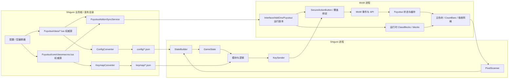

# Shigure 双项目系统全景

## AI 摘要

系统主闭环是：WoW 事件和 API 驱动 Fuyutsui 状态，Fuyutsui 将状态绘制成屏幕像素；Shigure 截屏解码为 `GameState`，用模块规则和 keymap 得出热键，再把按键发回 WoW。仓库内 `Fuyutsui/` 已成为内置权威源：Shigure 直接编辑这里的 Lua、生成 `config/*.json` 与 `keymap/*.json`，再将插件单向部署到游戏目录。

因此存在三条必须同步维护的跨项目接口：

1. [[40-跨项目/01-Shigure-像素生产消费契约|屏幕像素生产消费契约]]。
2. [[40-跨项目/02-Shigure-ClassBlocks到config同步契约|ClassBlocks 到 config 同步契约]]。
3. [[40-跨项目/03-Shigure-ClassMacros到keymap与按键契约|ClassMacros 到 keymap 与按键契约]]。

任何一端单独改变这些接口，都可能让系统“仍能启动但语义已经错误”。

## 范围与组件边界

### Fuyutsui 拥有

- WoW 内的事件订阅、运行时缓存和 SavedVariables。
- `ClassBlocks`、顶部 510 格、CountBars 和治疗吸收网格的生产。
- AuraContainer 与像素槽的绑定。
- `ClassMacros`、SecureActionButton 和覆盖绑定。
- 动作条键位扫描以及游戏内命令、快速按钮。

### Shigure 拥有

- 目标窗口定位、屏幕采样和 RGB 解码。
- `config` 合并、`GameState` 构建与运行快照。
- module 的存储、匹配、动态字段、条件和有序规则。
- keymap 查找、触发模式、节流和 Windows 按键发送。
- WinForms 界面、本地缓存、随机运行副本和会话协调。
- Fuyutsui Lua 表的轻量解析、可视化编辑和生成数据同步。
- 内置 `Fuyutsui/` 的构建分发，以及到目标游戏 `Interface/AddOns/Fuyutsui` 的 SHA-256 单向部署。

### 共享但不应重复拥有

- 像素字节和索引的含义。
- ClassBlocks 顺序如何转换为 Shigure `step`。
- 宏槽位、单位编号和热键池顺序。

这些内容由跨项目契约定义；项目功能页只说明本地如何实现该契约。

## 输入与输出

| 组件 | 主要输入 | 主要输出 |
|---|---|---|
| Fuyutsui 生命周期与领域模块 | WoW 事件、单位 API、职业/专精、SavedVariables | `Fuyutsui.state`、单位缓存、像素写入请求 |
| Fuyutsui `LoadPlayerBlocks` | 当前专精的 `ClassBlocks` | `Fuyutsui.blocks`、连续主色块索引、条定义 |
| Fuyutsui `core/block.lua` | 索引、业务值、光环与队伍信息 | 主色块行、CountBars、治疗吸收网格 |
| Shigure `PixelScanner` | 可见且未最小化的目标窗口 | `RowData`、`BarData`、`HealAbsorbData` 或失败原因 |
| Shigure `StateBuilder` | 三组原始采样数据、当前 `config` | `GameState.Values/Auras/Spells/Group` |
| Shigure `LogicRegistry` / module | `GameState`、模块选择、keymap | `LogicDecision` |
| Shigure `KeySender` | 决策中的 hotkey | 发送结果和可记录的失败原因 |
| Shigure Lua/部署子系统 | 内置 `Fuyutsui/class/*.lua`、`core/classmacros.lua` | 更新后的项目 Lua、`config/*.json`、`keymap/*.json`、游戏插件副本、运行时重启 |

## 运行链路

### 实时决策闭环

1. `Fuyutsui.toc` 按固定顺序加载核心、职业声明、领域模块和 `main.lua`。
2. `ADDON_LOADED` / `PLAYER_LOGIN` 触发 `OnInitialize` 与 `OnEnable`；事件和 `OnUpdate` 更新玩家、目标、法术、队伍等状态。
3. `LoadPlayerBlocks` 把当前专精 `states → auras → spells → items → group` 分配到连续主色块索引；`core/block.lua` 将值画到屏幕。
4. `PixelScanner.ScanScreenData` 使用 `CopyFromScreen` 采集顶部行、CountBars 标记行和治疗吸收网格。
5. `StateBuilder.Build` 先从主色块第 2、3 格识别职业和专精，再由 `ConfigService.BuildStateConfig` 合并配置并构建 `GameState`。
6. `LogicRegistry.Evaluate` 优先执行选定或最匹配 module；没有模块时才回退到 C# 职业逻辑或默认逻辑。
7. `ShigureRuntime` 按触发模式、规则延迟和逻辑节流判断是否调用 `KeySender`。
8. WoW 中由 Fuyutsui 创建的覆盖绑定或动作条接收按键，游戏状态变化后进入下一轮。

### 配置、宏与游戏副本部署

1. 配置页和宏页始终从 `AppPaths.BaseDirectory/Fuyutsui` 读取项目源，不直接读取游戏插件副本。
2. `ClassBlocksStore` 读写 `class/*.lua`；`ClassMacrosStore` 读写 `core/classmacros.lua`，保存只替换对应表字面量。
3. `FuyutsuiConfigConverter` 重新生成 `config`；`FuyutsuiKeymapConverter` 重新生成 `keymap`。
4. `WowProcessLocator` 每次从 `wow_process.txt` 读取进程名，按 Windows Z 顺序选择最靠前的候选可见窗口；`WowAddonLocator` 从该进程路径推导 `Interface/AddOns`。
5. 保存时只部署当前 Lua；启动与“更新配置”递归检查整个内置插件。缺失或 SHA-256 不同的文件会复制，相同文件跳过，游戏目录额外文件保留。
6. 主窗口串行等待生成/部署任务完成，刷新目录并按需重启运行会话；找不到游戏不会回滚项目源或阻止启动。

## 架构不变量

- **加载顺序是行为的一部分。** 新 Lua 文件必须加入 `Fuyutsui.toc`，且位于依赖定义之后、消费者之前。
- **屏幕协议没有独立协商通道。** 生产端改变颜色、索引、尺寸或标记时，消费端不会自动发现新版本。
- **生成物不是上游真相源。** `config` 和 `keymap` 可以重新生成；长期修复应落在 Lua 源数据或转换器。
- **游戏 AddOns 目录也不是上游真相源。** 只允许从内置 `Fuyutsui/` 单向部署；在游戏副本中手改的同名文件可能在下次同步被覆盖。
- **专精切换会改变绝对索引。** Shigure 必须使用与当前职业/专精一致的生成配置，不能写死业务字段列号。
- **module 决策只消费 `GameState` 和 keymap。** 它不应直接采样屏幕或解析 Fuyutsui Lua。
- **运行时状态只由主循环串行修改。** 外部启停意图进入命令队列，会话启动、停止和重启由协调器串行化。
- **宏安全状态受 WoW 限制。** SecureActionButton 的创建和绑定修改必须避开战斗锁定。

## 失败模式

| 现象 | 常见断点 |
|---|---|
| Shigure 找不到状态起始标记 | WoW 窗口不可见/最小化、第一格编码变化、缩放或屏幕布局错位 |
| 职业专精正确但字段全错位 | `ClassBlocks` 顺序与生成 `config` 不一致，或使用了旧 config |
| 普通状态正常而层数/治疗吸收缺失 | CountBars 标记或网格协议变化，主行扫描仍可成功 |
| 模块命中但找不到热键 | ClassMacros/keymap 未同步、技能名或单位/宏条件不一致 |
| 编辑器保存成功，运行结果未变化 | 转换/部署或运行时重启未完成，游戏未重载插件，或目标进程未被 `wow_process.txt` 选中 |
| 旧模块目标发生变化 | `UnitMappingVersion` 迁移缺失或把旧 `36/37` 继续当单位 |
| 文档建议无法定位 | 使用了拆分前 `main.lua` 的历史行号或已删除文件 |

## 修改影响

| 修改位置 | 必查影响 |
|---|---|
| `core/block.lua` 的 RGB、布局、条标记 | PixelScanner、StateBuilder、像素契约、游戏内实测 |
| `class/*.lua` 的顺序或结构 | `LoadPlayerBlocks`、ClassBlocksStore、ConfigConverter、已有 module 字段 |
| `core/classmacros.lua` 或宏键池 | `CreateMacro`、KeymapConverter、KeymapService、单位映射和槽位容量 |
| `GameState` 字段名/类型 | module 条件、动态字段、UI 字段目录和已有 JSON |
| module schema 或单位映射 | 迁移版本、编辑器、现有 module 文件和 README 示例 |
| 随机副本或基础目录解析 | config/keymap/module/cache 路径及打包结果 |
| 内置插件目录或部署策略 | csproj 发布内容、编辑器路径、AddonSyncService、游戏目录权限和重载流程 |

完整验收见 [[40-跨项目/04-Shigure-兼容性变更检查清单|兼容性变更检查清单]]。

## 源码索引

### Fuyutsui

- `Fuyutsui/Fuyutsui.toc`：实际加载清单。
- `Fuyutsui/core/core.lua`：初始化、事件帧、SavedVariables。
- `Fuyutsui/core/events.lua`：事件处理与分频 `OnUpdate`。
- `Fuyutsui/main.lua`：`LoadPlayerBlocks`、`LoadPlayerMacros`、初始刷新。
- `Fuyutsui/core/block.lua`：三类屏幕输出与 AuraContainer。
- `Fuyutsui/core/macro.lua`、`core/classmacros.lua`：宏生产和职业数据。

### Shigure

- `App/Program.cs`、`ShigureRuntimeFactory.cs`：组合根和依赖组装。
- `App/RuntimeSessionCoordinator.cs`：会话串行化。
- `Runtime/PixelScanner.cs`：屏幕采集。
- `Runtime/StateBuilder.cs`、`GameState.cs`：状态转换。
- `Runtime/ShigureRuntime.cs`：触发和逻辑循环。
- `Modules/ModuleStore.cs`、`LogicRegistry.cs`：规则执行和回退。
- `Input/KeymapService.cs`、`KeySender.cs`：热键解析和发送。
- `Infrastructure/*Fuyutsui*Converter.cs`：两条生成链路。
- `Infrastructure/FuyutsuiAddonSyncService.cs`、`WowAddonLocator.cs`、`WowProcessLocator.cs`：内置源部署和目标路径定位。

## 知识图谱

## 关系

- 上级：[[00-导航/00-Shigure-知识库首页|Shigure 知识库首页]]
- 生产端：[[20-Fuyutsui/00-Fuyutsui-MOC|Fuyutsui MOC]]
- 消费端：[[30-Shigure/00-Shigure-MOC|Shigure MOC]]
- 接口：[[40-跨项目/00-Shigure-跨项目契约-MOC|跨项目契约 MOC]]
